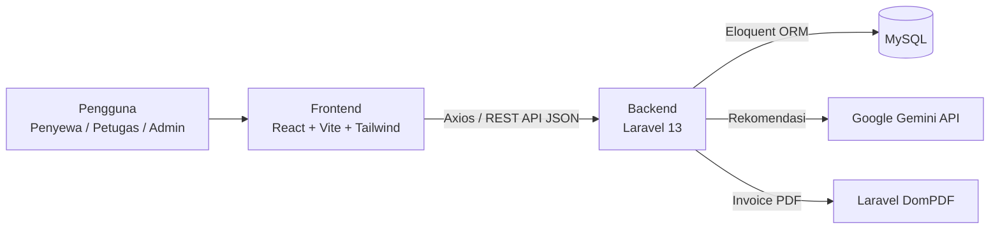
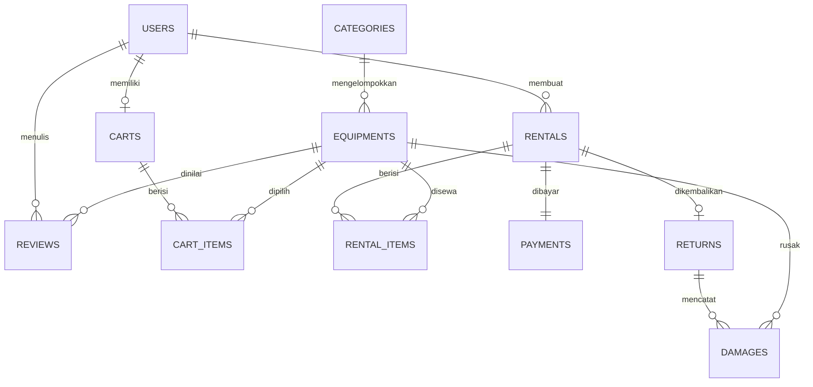
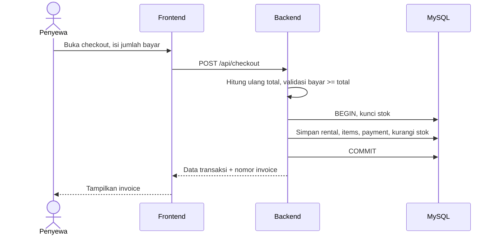

# Deskripsi Perancangan Perangkat Lunak (DPPL)

**RenTech Web App – Equipment Rental**

## 1. Pendahuluan

### 1.1 Tujuan Penulisan Dokumen

Dokumen DPPL ini menjelaskan rancangan arsitektur, data, antarmuka, dan perilaku perangkat lunak RenTech berdasarkan kebutuhan pada dokumen SKPL. Dokumen ini menjadi panduan implementasi bagi tim backend, frontend, dan QA.

### 1.2 Lingkup Masalah

RenTech adalah aplikasi web untuk mengelola penyewaan peralatan: katalog, keranjang, checkout dan pembayaran, invoice PDF, pengambilan dan pengembalian, review, dashboard, serta rekomendasi peralatan berbasis AI.

---

## 2. Perancangan Arsitektur

### 2.1 Gambaran Arsitektur

RenTech memakai arsitektur client-server tiga lapis dengan pemisahan frontend dan backend yang berkomunikasi melalui REST API (JSON).

| Lapisan | Teknologi | Tanggung Jawab |
|---|---|---|
| Presentasi (Frontend) | React.js, Vite, Tailwind CSS, React Router, Axios | Antarmuka SPA, navigasi, pemanggilan API, tampilan sesuai role |
| Aplikasi (Backend) | Laravel 13 (PHP), Laravel Authentication, Laravel DomPDF | Logika bisnis, validasi, otorisasi, perhitungan biaya dan denda, invoice, integrasi AI |
| Data | MySQL, Eloquent ORM | Penyimpanan data persisten dan relasi antar entitas |
| Layanan Eksternal | Google Gemini API | Pemberi rekomendasi peralatan (hanya pendukung) |

Alur umum: pengguna membuka antarmuka React, React memanggil endpoint Laravel melalui Axios dengan token autentikasi, Laravel memvalidasi dan memproses permintaan lewat Eloquent ke MySQL, lalu mengembalikan respons JSON yang ditampilkan oleh React. Untuk rekomendasi AI, Laravel menjadi perantara ke Gemini API sehingga kunci API tidak terekspos ke klien.

### 2.2 Struktur Backend (MVC Laravel)

| Komponen | Contoh |
|---|---|
| Model | User, Category, Equipment, Cart, CartItem, Rental, RentalItem, Payment, Return, Damage, Review |
| Controller | AuthController, UserController, CategoryController, EquipmentController, CartController, RentalController, PaymentController, InvoiceController, ReturnController, ReviewController, DashboardController, AiRecommendationController |
| Service | RentalCostService (hitung biaya), StockService (cek dan ubah stok), FineService (hitung denda), GeminiService (panggil API AI) |
| Middleware | auth, role (penyewa, petugas, admin) |
| Request/Validation | Form Request untuk validasi input tiap endpoint |
| View | Template Blade untuk invoice PDF (DomPDF) |

### 2.3 Struktur Frontend

| Bagian | Isi |
|---|---|
| pages | Login, Register, Katalog, DetailPeralatan, Keranjang, Checkout, Riwayat, Invoice, Rekomendasi AI, Dashboard, KelolaPeralatan, KelolaKategori, KelolaPengguna, Transaksi, Pengembalian |
| components | Navbar, Sidebar, EquipmentCard, CartItem, RatingStars, Modal, Table, Form |
| services | Instance Axios, fungsi pemanggil endpoint per fitur |
| routes | React Router dengan proteksi route berdasarkan role |
| context/state | Status autentikasi pengguna dan isi keranjang |

### 2.4 Keputusan Rancangan

- Seluruh perhitungan biaya, stok, dan denda dilakukan di backend agar konsisten dan tidak dapat dimanipulasi dari klien.
- Proses checkout, pembayaran, dan pengurangan stok dijalankan dalam satu transaksi database (atomik).
- Data pada hasil rekomendasi AI selalu diambil ulang dari database berdasarkan ID peralatan; keluaran AI hanya dipakai sebagai daftar ID/alasan.
- Kegagalan Gemini API ditangani dengan pesan kesalahan tanpa memengaruhi fitur lain.

---

## 3. Perancangan Data

### 3.1 Relasi Antar Entitas

- Satu **Category** memiliki banyak **Equipment**.
- Satu **User** memiliki banyak **Rental**, **Review**, dan satu **Cart** aktif.
- Satu **Rental** memiliki banyak **RentalItem**, satu **Payment**, dan satu **Return**.
- Satu **Equipment** muncul pada banyak **RentalItem** dan **Review**.
- Satu **Return** dapat memiliki banyak **Damage** (per item).

### 3.2 Rancangan Tabel

#### `users`

| Kolom | Tipe | Keterangan |
|---|---|---|
| id | BIGINT PK | |
| name | VARCHAR(100) | |
| email | VARCHAR(150) UNIQUE | |
| password | VARCHAR(255) | Hash |
| role | ENUM(penyewa, petugas, admin) | |
| id_number | VARCHAR(30) NULL | Nomor identitas |
| phone | VARCHAR(20) NULL | |
| is_active | BOOLEAN | |
| created_at, updated_at | TIMESTAMP | |

#### `categories`

| Kolom | Tipe | Keterangan |
|---|---|---|
| id | BIGINT PK | |
| name | VARCHAR(100) UNIQUE | |
| description | TEXT NULL | |

#### `equipments`

| Kolom | Tipe | Keterangan |
|---|---|---|
| id | BIGINT PK | |
| category_id | BIGINT FK | categories.id |
| name | VARCHAR(150) | |
| brand | VARCHAR(100) | |
| photo | VARCHAR(255) NULL | Path foto |
| description | TEXT | |
| specification | TEXT | |
| price_per_day | DECIMAL(12,2) | |
| stock | INT | Stok tersedia |
| total_stock | INT | Total unit |
| condition | ENUM(baik, cukup, rusak) | |
| status | ENUM(tersedia, tidak_tersedia) | |

#### `carts` dan `cart_items`

| Tabel | Kolom |
|---|---|
| carts | id PK, user_id FK |
| cart_items | id PK, cart_id FK, equipment_id FK, quantity INT, start_date DATE, end_date DATE |

#### `rentals`

| Kolom | Tipe | Keterangan |
|---|---|---|
| id | BIGINT PK | |
| invoice_number | VARCHAR(30) UNIQUE | |
| user_id | BIGINT FK | users.id |
| start_date, end_date | DATE | Periode sewa |
| total_price | DECIMAL(12,2) | |
| status | ENUM(menunggu_pembayaran, dibayar, diambil, dikembalikan, terlambat, dibatalkan) | |
| created_at, updated_at | TIMESTAMP | |

#### `rental_items`

| Kolom | Tipe | Keterangan |
|---|---|---|
| id | BIGINT PK | |
| rental_id | BIGINT FK | |
| equipment_id | BIGINT FK | |
| quantity | INT | |
| price_per_day | DECIMAL(12,2) | Snapshot harga saat transaksi |
| duration_days | INT | |
| subtotal | DECIMAL(12,2) | |

#### `payments`

| Kolom | Tipe | Keterangan |
|---|---|---|
| id | BIGINT PK | |
| rental_id | BIGINT FK | |
| method | VARCHAR(30) | Tunai, transfer, dan sejenisnya |
| amount_total | DECIMAL(12,2) | |
| amount_paid | DECIMAL(12,2) | |
| change_amount | DECIMAL(12,2) | Kembalian |
| status | ENUM(pending, berhasil, gagal) | |
| paid_at | TIMESTAMP NULL | |

#### `returns`

| Kolom | Tipe | Keterangan |
|---|---|---|
| id | BIGINT PK | |
| rental_id | BIGINT FK | |
| officer_id | BIGINT FK | users.id (petugas) |
| picked_up_at | DATETIME NULL | Waktu pengambilan |
| pickup_condition_note | TEXT NULL | Kondisi sebelum dipakai |
| returned_at | DATETIME NULL | Waktu pengembalian |
| return_condition_note | TEXT NULL | Kondisi setelah dipakai |
| late_days | INT | |
| late_fine | DECIMAL(12,2) | |
| damage_fine | DECIMAL(12,2) | |
| total_fine | DECIMAL(12,2) | |

#### `damages`

| Kolom | Tipe | Keterangan |
|---|---|---|
| id | BIGINT PK | |
| return_id | BIGINT FK | |
| equipment_id | BIGINT FK | |
| description | TEXT | |
| fine_amount | DECIMAL(12,2) | |

#### `reviews`

| Kolom | Tipe | Keterangan |
|---|---|---|
| id | BIGINT PK | |
| user_id | BIGINT FK | |
| equipment_id | BIGINT FK | |
| rental_id | BIGINT FK | UNIQUE bersama equipment_id dan user_id |
| rating | TINYINT | 1 sampai 5 |
| comment | TEXT NULL | |
| created_at | TIMESTAMP | |

---

## 4. Perancangan Proses dan Logika Bisnis

### 4.1 Perhitungan Biaya Sewa

Durasi dihitung dari selisih tanggal mulai dan selesai (minimal 1 hari). Subtotal tiap item adalah harga per hari × jumlah × durasi. Total sewa adalah penjumlahan seluruh subtotal. Harga per hari disalin ke `rental_items` saat checkout sehingga perubahan harga di kemudian hari tidak memengaruhi transaksi lama.

### 4.2 Pemeriksaan Ketersediaan Stok

Sebelum item masuk keranjang dan sekali lagi saat checkout, `StockService` memeriksa bahwa jumlah diminta tidak melebihi stok yang tersisa pada periode sewa (stok total dikurangi jumlah pada penyewaan aktif yang periodenya beririsan). Pemeriksaan ulang saat checkout menggunakan penguncian baris database untuk mencegah dua pengguna menyewa stok terakhir yang sama.

### 4.3 Alur Checkout dan Pembayaran

1. Penyewa membuka checkout; backend menghitung ulang total dari isi keranjang.
2. Penyewa memasukkan metode dan jumlah bayar.
3. Backend memvalidasi jumlah bayar ≥ total, lalu menghitung kembalian = bayar − total.
4. Dalam satu transaksi database: buat rental dan rental_items, buat payment, kurangi stok, kosongkan keranjang, set status rental menjadi `dibayar`.
5. Backend membuat nomor invoice dan mengembalikan data transaksi; frontend mengarahkan ke halaman invoice.

Bila langkah mana pun gagal, seluruh perubahan dibatalkan (rollback).

### 4.4 Pembuatan Invoice

`InvoiceController` mengambil data rental beserta pengguna, item, dan pembayaran, merender template Blade, lalu DomPDF menghasilkan PDF untuk diunduh. Halaman invoice di frontend juga menyediakan tombol cetak peramban.

### 4.5 Pengambilan dan Pengembalian

- **Pengambilan:** petugas memilih transaksi berstatus `dibayar`, mencatat kondisi barang, dan mengonfirmasi; status menjadi `diambil` dan waktu pengambilan tercatat.
- **Pengembalian:** petugas mencatat waktu dan kondisi barang. Keterlambatan = max(0, tanggal kembali − tanggal selesai) hari; denda keterlambatan = hari terlambat × tarif denda harian (persentase dari harga sewa harian, ditetapkan sebagai konfigurasi sistem). Bila ada kerusakan, petugas menambahkan data `damages` dengan nominal denda.
- Total denda = denda keterlambatan + total denda kerusakan. Setelah dikonfirmasi, stok dikembalikan, kondisi peralatan diperbarui bila perlu, dan status rental menjadi `dikembalikan`.

### 4.6 Rekomendasi AI

1. Penyewa menulis kebutuhan, misalnya untuk membuat video dokumenter sebuah acara.
2. Backend mengambil daftar peralatan tersedia dari database (id, nama, kategori, spesifikasi ringkas).
3. `GeminiService` menyusun prompt berisi kebutuhan pengguna dan daftar tersebut, serta meminta keluaran JSON berisi ID peralatan dan alasan singkat.
4. Backend memvalidasi keluaran: hanya ID yang ada di database dan tersedia yang diterima.
5. Backend mengambil data lengkap (harga, stok, ketersediaan) dari database dan mengirimkannya ke frontend bersama alasan dari AI.
6. Jika API gagal, melebihi batas waktu, atau keluaran tidak valid, sistem mengembalikan pesan kesalahan yang ramah dan pengguna tetap dapat memakai katalog biasa.

### 4.7 Review

Review hanya dapat dibuat oleh pemilik transaksi berstatus `dikembalikan`, sekali per peralatan per transaksi. Rata-rata rating dihitung dari tabel `reviews` dan ditampilkan pada halaman detail peralatan.

### 4.8 Dashboard

`DashboardController` mengagregasi data: total peralatan, total stok tersedia, jumlah transaksi, total pendapatan (dari pembayaran berhasil), peralatan terbanyak disewa (agregat `rental_items`), rental berstatus `diambil`, dan riwayat pengembalian. Hasilnya dapat difilter berdasarkan periode.

---

## 5. Perancangan REST API

Semua endpoint berawalan `/api` dan memakai JSON. Kolom Akses menunjukkan role yang diizinkan.

| Metode | Endpoint | Fungsi | Akses |
|---|---|---|---|
| POST | `/register` | Registrasi akun | Publik |
| POST | `/login` | Login dan menerima token | Publik |
| POST | `/logout` | Logout | Terautentikasi |
| GET | `/users` | Daftar pengguna | Admin |
| PUT | `/users/{id}` | Ubah role/status pengguna | Admin |
| GET | `/categories` | Daftar kategori | Terautentikasi |
| POST, PUT, DELETE | `/categories`, `/categories/{id}` | Kelola kategori | Admin |
| GET | `/equipments` | Katalog (query: search, category, available, price) | Terautentikasi |
| GET | `/equipments/{id}` | Detail peralatan dan review | Terautentikasi |
| POST, PUT, DELETE | `/equipments`, `/equipments/{id}` | Kelola peralatan | Admin |
| GET | `/cart` | Lihat keranjang | Penyewa |
| POST | `/cart/items` | Tambah item | Penyewa |
| PUT, DELETE | `/cart/items/{id}` | Ubah atau hapus item | Penyewa |
| POST | `/checkout` | Checkout dan pembayaran | Penyewa |
| GET | `/rentals` | Riwayat (milik sendiri; semua untuk Admin/Petugas) | Terautentikasi |
| GET | `/rentals/{id}` | Detail transaksi | Pemilik, Petugas, Admin |
| GET | `/rentals/{id}/invoice` | Unduh invoice PDF | Pemilik, Admin |
| POST | `/rentals/{id}/pickup` | Konfirmasi pengambilan | Petugas, Admin |
| POST | `/rentals/{id}/return` | Proses pengembalian, kerusakan, denda | Petugas, Admin |
| POST | `/reviews` | Kirim review | Penyewa |
| GET | `/reviews` | Daftar review | Admin |
| POST | `/ai/recommendations` | Rekomendasi peralatan berbasis AI | Penyewa |
| GET | `/dashboard` | Data dashboard dan laporan | Admin, Petugas |

Format respons seragam berisi status keberhasilan, pesan, dan data. Kesalahan validasi mengembalikan kode 422, autentikasi gagal 401, tanpa hak akses 403, dan data tidak ditemukan 404.

---

## 6. Perancangan Antarmuka

### 6.1 Peta Halaman Berdasarkan Role

| Role | Halaman |
|---|---|
| Penyewa | Login/Registrasi, Katalog, Detail Peralatan, Keranjang, Checkout, Riwayat dan Status Sewa, Invoice, Rekomendasi AI, Review |
| Petugas | Daftar Transaksi, Konfirmasi Pengambilan, Form Pengembalian (kondisi, kerusakan, denda), Dashboard Operasional |
| Admin | Seluruh halaman Petugas, Kelola Peralatan, Kelola Kategori, Kelola Pengguna, Laporan dan Dashboard, Daftar Review |

### 6.2 Rancangan Halaman Utama

| Halaman | Elemen Utama |
|---|---|
| Katalog | Kolom pencarian, filter kategori/harga/ketersediaan, kartu peralatan (foto, nama, merek, harga per hari, stok, kondisi), tombol tambah ke keranjang |
| Detail Peralatan | Foto, spesifikasi, harga, stok, kondisi, rata-rata rating, daftar ulasan, pemilih jumlah dan tanggal sewa |
| Keranjang | Daftar item, pengubah jumlah dan durasi, subtotal, total, tombol checkout |
| Checkout | Ringkasan pesanan, total, input jumlah bayar, tampilan kembalian, tombol bayar |
| Invoice | Data pengguna, daftar peralatan, durasi, harga, total, bayar, kembalian, tombol unduh PDF dan cetak |
| Rekomendasi AI | Kolom teks kebutuhan, tombol minta rekomendasi, kartu hasil rekomendasi dengan alasan dan tombol tambah ke keranjang |
| Form Pengembalian | Data transaksi, waktu kembali, kondisi barang, input kerusakan dan denda, ringkasan total denda |
| Dashboard | Kartu ringkasan, grafik penyewaan dan pendapatan, daftar peralatan terlaris, rental berlangsung |

Desain visual rinci (wireframe, prototype, style guide) dibuat pada Figma dan menjadi acuan implementasi React.js dan Tailwind CSS.

### 6.3 Prinsip Antarmuka

- Responsif untuk desktop dan mobile.
- Konsisten dalam warna, tipografi, dan komponen.
- Pesan kesalahan dan konfirmasi yang jelas pada setiap aksi penting (checkout, pengembalian, hapus data).
- Menu dan route yang ditampilkan menyesuaikan role pengguna.

---

## 7. Perancangan Keamanan dan Penanganan Kesalahan

| Aspek | Rancangan |
|---|---|
| Autentikasi | Laravel Authentication; kata sandi di-hash; token dikirim pada header setiap permintaan API |
| Otorisasi | Middleware role pada route; pemeriksaan kepemilikan data (pengguna hanya mengakses transaksinya sendiri) |
| Validasi | Form Request di backend pada semua input; validasi tambahan di frontend untuk kenyamanan |
| Proteksi serangan | Eloquent (parameterized query) terhadap SQL injection, escaping keluaran terhadap XSS, proteksi CSRF dan CORS terbatas ke domain frontend |
| Rahasia | Kunci Gemini API dan kredensial database di berkas `.env` server |
| Konsistensi data | Transaksi database dengan rollback pada checkout dan pengembalian |
| Kesalahan AI | Timeout, validasi keluaran, dan pesan fallback |
| Pencatatan | Log kesalahan server menggunakan logging bawaan Laravel |

---

## 8. Rencana Pengujian Singkat

Pengujian dikoordinasi oleh QA dengan acuan SKPL. Skenario utama:

| Area | Contoh Skenario Uji |
|---|---|
| Autentikasi | Registrasi, login valid dan tidak valid, akses halaman terlarang per role |
| Katalog | Pencarian, filter, tampilan stok dan kondisi, CRUD peralatan oleh admin |
| Penyewaan | Tambah ke keranjang, stok tidak cukup, perhitungan biaya berbagai durasi |
| Pembayaran | Bayar pas, bayar lebih (kembalian), bayar kurang (ditolak), rollback saat gagal |
| Invoice | Isi invoice sesuai transaksi, unduh PDF, cetak |
| Pengembalian | Tepat waktu, terlambat (denda), rusak (denda kerusakan), pemulihan stok |
| AI | Berbagai variasi kebutuhan, keluaran di luar database, API gagal |
| Review | Hanya setelah selesai, satu kali per peralatan |
| Dashboard | Kesesuaian angka dengan data transaksi |

---

## 9. Pemetaan Kebutuhan ke Rancangan

| Kebutuhan SKPL | Rancangan Terkait |
|---|---|
| SKPL-F-001 s.d. 005 | Tabel `users`, AuthController, UserController, middleware role |
| SKPL-F-006 s.d. 011 | Tabel `categories` dan `equipments`, EquipmentController, StockService |
| SKPL-F-012 s.d. 016 | Tabel `carts`, `cart_items`, `rentals`, CartController, RentalCostService |
| SKPL-F-017 s.d. 020 | Tabel `payments`, PaymentController, alur checkout (bagian 4.3) |
| SKPL-F-021 s.d. 023 | InvoiceController, template Blade, DomPDF (bagian 4.4) |
| SKPL-F-024 s.d. 029 | Tabel `returns` dan `damages`, ReturnController, FineService (bagian 4.5) |
| SKPL-F-030 s.d. 034 | AiRecommendationController, GeminiService (bagian 4.6) |
| SKPL-F-035 s.d. 038 | Tabel `reviews`, ReviewController (bagian 4.7) |
| SKPL-F-039 s.d. 041 | DashboardController (bagian 4.8) |
| SKPL-NF-001 s.d. 011 | Arsitektur (bab 2), keamanan dan penanganan kesalahan (bab 7) |
